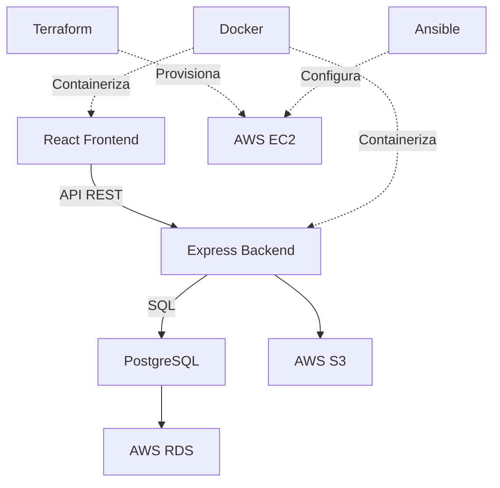

<div align="center">

# ITERIA

### Gestor de Proyectos con Metodología Ágil


</div>

---

## ¿Qué es Iteria?

Plataforma web innovadora de gestión de proyectos basada en **metodologías ágiles**, diseñada específicamente para dos públicos:

<table>
<tr>
<td width="50%">

### Versión Estudiantes
```
✓ Interfaz minimalista
✓ Aprendizaje guiado
✓ Funciones esenciales
✓ Sin complejidad
```

</td>
<td width="50%">

### Versión Empresas
```
✓ Sistema avanzado de roles
✓ Reportes y métricas
✓ Escalable
✓ Equipos profesionales
```

</td>
</tr>
</table>

---

---

## Tech Stack

<div align="center">

### Frontend


### Backend


### Infraestructura & DevOps


### Herramientas


</div>

---

---

## Arquitectura



---

## Equipo DevOps

<div align="center">

| Desarrollador | Matrícula |
|:---:|:---:|
| **Aldo Vladimir Villanueva Ramírez** | `3039425` |
| **Angel Gallardo Martínez** | `3060144` |
| **David Hernan Ortiz Arredondo** | `2761144` |
| **José Angel Valdés García** | `29565890` |

</div>

---

