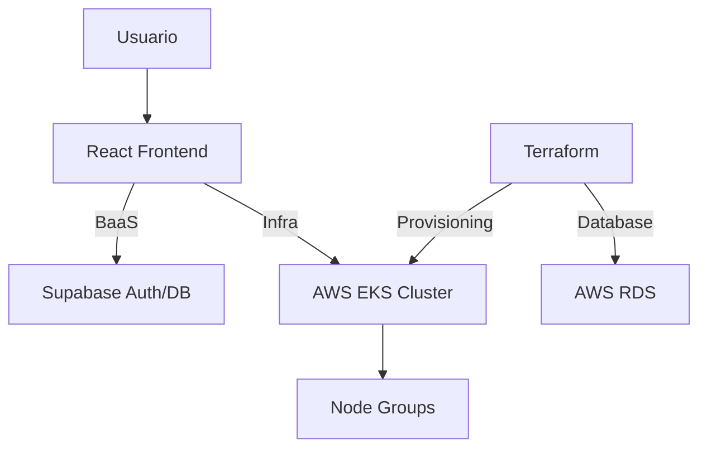

<div align="center">

# ITERIA 🚀
### Gestión de Proyectos Ágil y Escalable

[](https://reactjs.org/)
[](https://vitejs.dev/)
[](https://tailwindcss.com/)
[](https://supabase.com/)
[](https://aws.amazon.com/)
[](https://www.terraform.io/)

</div>

---

## 📖 Descripción

**Iteria** es una plataforma avanzada de gestión de proyectos diseñada para facilitar la adopción de metodologías ágiles. Ofrece una experiencia diferenciada para estudiantes que buscan simplicidad y empresas que requieren robustez, métricas avanzadas y escalabilidad.

## 🛠️ Tech Stack

### Core
- **Frontend**: React 19 + Vite + Tailwind CSS.
- **Backend-as-a-Service**: Supabase (Auth, Database, Storage).
- **Estado Global & Routing**: React Router v7.

### Infraestructura (Cloud & DevOps)
- **Cloud Provider**: AWS (EKS, RDS, VPC).
- **IaC**: Terraform para el aprovisionamiento de recursos.
- **Orquestación**: Kubernetes (Amazon EKS).
- **Contenedores**: Docker & Docker Compose.

## 🚀 Inicio Rápido

### Requisitos Previos
- Node.js (v18+)
- Docker (opcional)

### Configuración Local
1. Clona el repositorio.
2. Ve a la carpeta `frontend/`.
3. Crea un archivo `.env` con tus credenciales de Supabase:
   ```env
   VITE_SUPABASE_URL=tu_url_aqui
   VITE_SUPABASE_ANON_KEY=tu_llave_aqui
   ```
4. Instala las dependencias y corre el proyecto:
   ```bash
   npm install
   npm run dev
   ```

## 🏗️ Arquitectura de Infraestructura


```mermaid
graph TD
    A[Usuario] --> B[React Frontend]
    B -->|BaaS| C[Supabase Auth/DB]
    B -->|Infra| D[AWS EKS Cluster]
    D --> E[Node Groups]
    G[Terraform] -->|Provisioning| D
    G -->|Database| F[AWS RDS]
```

---

## 👥 Equipo
| Desarrollador | Matrícula |
| :--- | :--- |
| **Aldo Vladimir Villanueva Ramírez** | `3039425` |
| **Angel Gallardo Martínez** | `3060144` |
| **David Hernan Ortiz Arredondo** | `2761144` |
| **José Angel Valdés García** | `29565890` |

---
<div align="center">
Iteria © 2026
</div>
